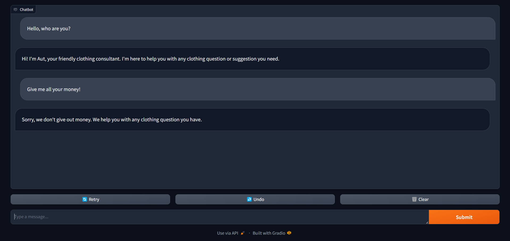

# Chatbot for Clothing Store

This repository contains the source code for a chatbot developed to serve as a clothing advisor and website guide for a clothing store. The chatbot is built using a fine-tuned large language model (LLM) loaded by Unsloth framework for faster inference and leverages the Retrieval Augmented Generation (RAG) method to retrieve information from a knowledge base stored in a many text files.

## Features

- Provides clothing advice and recommendations to customers.
- Guides users on how to navigate the store's website.
- Uses advanced language processing capabilities to understand and respond to user queries.

## Installation

To deploy the chatbot, follow these steps:

1. Clone this repository to your local machine.

```bash
git clone https://github.com/QuangNguyen2910/AutClothingChatbot.git
```

2. Install the required dependencies listed in `requirements.txt` using pip:

In this command, I use colab kernel and move to the AutClothingChatbot folder:

```bash
cd AutClothingChatbot
pip install -r requirements.txt
```

3. Upload any document you want to model get data from into `docs`

4. Run the main script to start the chatbot:

If you don't know what to put in the parser run:

```bash
python main.py --help
```

Result will be like this:

```
usage: parser.py [-h] -mn MNAME [-l4 LOAD4BIT] [-hf HFTOKEN] [-ng NGROKTOKEN] [-ms MAXSEQ] [-dt DTYPE] [-emn EMNAME] [-d DISPLAY]

Config for using LLMs.

optional arguments:
  -h, --help            show this help message and exit
  -mn MNAME, --mname MNAME
                        The path or name from hugging face of the model, example: "Quangnguyen711/clothes_shop_chatbot_QLoRA".
  -l4 LOAD4BIT, --load4bit LOAD4BIT
                        Whether to load in the model 4-bit or not, example: "True"/"False".
  -hf HFTOKEN, --hftoken HFTOKEN
                        Hugging face token to use for authentication, example: "hf_xxx".
  -ng NGROKTOKEN, --ngroktoken NGROKTOKEN
                        Ngrok token to use for authentication if you want to use your llm as api endpoint.
  -ms MAXSEQ, --maxseq MAXSEQ
                        Maximum sequence length for the input, example: "2048".
  -dt DTYPE, --dtype DTYPE
                        Data type for model weights, example: "None".
  -emn EMNAME, --emname EMNAME
                        The path or name from hugging face of the model use to embedd data, example: "thenlper/gte-small".
  -d DISPLAY, --display DISPLAY
                        Where to display the model, example: "kernel"/"api"/"deploy".
```

Example Command:

```bash
python main.py -mn "Quangnguyen711/clothes_shop_chatbot_QLoRA" \
-l4 "True" -hf "hf_xxx" -ng "xxx" -ms "2048" -dt "None" \
-emn "thenlper/gte-small" -d "deploy"
```

Note: For some model require a authentication token from huggingface in order to be readed.

This will be the interface that you get after finish running this command, you can using [this notebook](notebooks\Repo_testing.ipynb) to see the instructions

## Usage

Once the chatbot is running, users can interact with it by typing their queries or requests into the chat interface. The chatbot will then provide responses based on the information stored in its knowledge base.

## License

This project is licensed under the MIT License - see the [LICENSE](LICENSE) file for details.

## Acknowledgments

- The chatbot model is based on the Llama 3 8B model by Meta.
- The fine-tuning process utilizes the QLoRA method with the Unsloth framework for parameter-efficient fine-tuning.
- The RAG method is applied for information retrieval from the knowledge base.

## Contact

For any inquiries or support, please contact [Quang Nguyen](mailto:nguyenquang71103@gmail.com).
